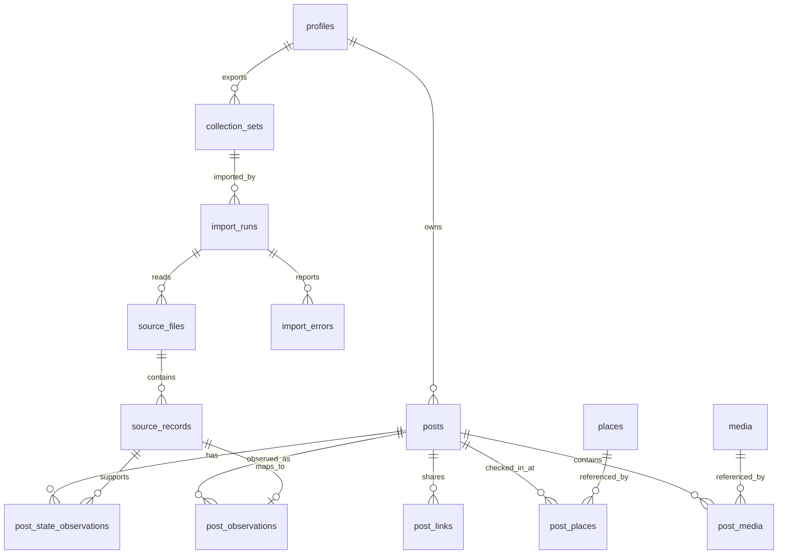

# SQLite Data Model and Record Matching

## Status

This document defines the approved design target for the initial read-only inventory. It is not an implementation or migration file.

The design is based on the Facebook export inspected on July 21, 2026. The export contains 22,966 primary timeline records. Of those records:

- 2,230 belong to 1,096 groups that share the same creation timestamp.
- Up to seven records share one creation timestamp.
- 302 belong to 132 groups that share both creation timestamp and post text.
- 2,186 contain no post text.

Timestamp, text, file position, and filename are therefore insufficient as independent post identities.

## Design Principles

- SQLite is the authoritative inventory.
- A canonical post is separate from every observation imported from Facebook.
- Original source records are retained for traceability.
- Exact identifiers take precedence over derived fingerprints.
- Matching is deterministic and versioned.
- Ambiguous records are not silently merged.
- Re-importing the same export is idempotent.
- Secondary media files do not create posts by themselves.
- Missing data remains unavailable rather than inferred.
- All timestamps retain the original Unix value and a normalized UTC representation.

## Database Location and SQLite Settings

The database will be stored in a user-selected OneDrive folder.

Required connection behavior:

```text
PRAGMA foreign_keys = ON;
PRAGMA journal_mode = DELETE;
PRAGMA synchronous = FULL;
PRAGMA busy_timeout = 5000;
```

WAL mode must not be used for the OneDrive-hosted database. WAL uses additional sidecar files that can be synchronized separately from the database.

Only one application instance may write to the database. The application must create an adjacent instance-lock file containing the process ID, computer name, application start time, and database path. A stale lock may be cleared only after confirming that its process is no longer running on the recorded computer.

## Entity Relationships



## Tables

### `schema_metadata`

Tracks database and matching-rule versions.

| Column | Type | Rules |
| --- | --- | --- |
| `key` | TEXT | Primary key. |
| `value` | TEXT | Required. |

Required keys include `schema_version`, `identity_version`, `created_at_utc`, and `application_version`.

### `profiles`

Separates inventory ownership without requiring a profile name in reports.

| Column | Type | Rules |
| --- | --- | --- |
| `profile_id` | TEXT | Primary key using a locally generated UUID. |
| `facebook_profile_id` | TEXT | Nullable. Unique when available. |
| `profile_label` | TEXT | User-selected local label. Nullable. |
| `created_at_utc` | TEXT | Required ISO 8601 UTC value. |

### `collection_sets`

Represents one logical Facebook export, which may span multiple downloaded folders.

| Column | Type | Rules |
| --- | --- | --- |
| `collection_set_id` | TEXT | Primary key UUID. |
| `profile_id` | TEXT | Required foreign key. |
| `export_date` | TEXT | Nullable date reported by the export. |
| `source_fingerprint` | TEXT | Required SHA-256 fingerprint. Unique per profile. |
| `root_count` | INTEGER | Required and greater than zero. |
| `registered_at_utc` | TEXT | Required. |

`source_fingerprint` is calculated from the sorted relative paths, file sizes, and SHA-256 hashes of recognized metadata files. Absolute paths and folder names are excluded.

### `import_runs`

Tracks every attempted import.

| Column | Type | Rules |
| --- | --- | --- |
| `import_run_id` | TEXT | Primary key UUID. |
| `collection_set_id` | TEXT | Required foreign key. |
| `started_at_utc` | TEXT | Required. |
| `completed_at_utc` | TEXT | Nullable. |
| `status` | TEXT | `running`, `completed`, `completed_with_errors`, or `failed`. |
| `records_examined` | INTEGER | Required, default zero. |
| `posts_added` | INTEGER | Required, default zero. |
| `posts_updated` | INTEGER | Required, default zero. |
| `records_matched` | INTEGER | Required, default zero. |
| `records_ambiguous` | INTEGER | Required, default zero. |
| `records_skipped` | INTEGER | Required, default zero. |
| `error_count` | INTEGER | Required, default zero. |

### `source_files`

Records every recognized JSON source file.

| Column | Type | Rules |
| --- | --- | --- |
| `source_file_id` | INTEGER | Primary key. |
| `import_run_id` | TEXT | Required foreign key. |
| `export_root_number` | INTEGER | Required local ordinal. |
| `relative_path` | TEXT | Required normalized relative path. |
| `source_kind` | TEXT | Required recognized source classification. |
| `size_bytes` | INTEGER | Required. |
| `sha256` | TEXT | Required. |
| `record_count` | INTEGER | Nullable until parsed. |
| `parse_status` | TEXT | `pending`, `completed`, `partial`, `unsupported`, or `failed`. |

The unique key is `(import_run_id, export_root_number, relative_path)`.

### `source_records`

Preserves each parsed Facebook record and its provenance.

| Column | Type | Rules |
| --- | --- | --- |
| `source_record_id` | INTEGER | Primary key. |
| `source_file_id` | INTEGER | Required foreign key. |
| `record_index` | INTEGER | Required zero-based index in the parsed array. |
| `source_kind` | TEXT | Required. |
| `raw_json` | TEXT | Required exact parsed-record JSON serialized canonically. |
| `raw_sha256` | TEXT | Required. |
| `semantic_fingerprint` | TEXT | Nullable until normalization succeeds. |
| `facebook_post_id` | TEXT | Nullable. |
| `created_timestamp` | INTEGER | Nullable original Unix seconds. |
| `parse_status` | TEXT | `parsed`, `partial`, `unsupported`, or `failed`. |
| `match_status` | TEXT | `pending`, `matched`, `created`, `ambiguous`, or `skipped`. |

The unique key is `(source_file_id, record_index)`. File position is provenance only and is never used as cross-export identity.

### `posts`

Stores one canonical inventory row per post.

| Column | Type | Rules |
| --- | --- | --- |
| `post_id` | INTEGER | Primary key. |
| `record_id` | TEXT | Required locally generated UUID. Unique and immutable. |
| `profile_id` | TEXT | Required foreign key. |
| `facebook_post_id` | TEXT | Nullable. |
| `direct_post_url` | TEXT | Nullable. |
| `normalized_direct_post_url` | TEXT | Nullable. Required when `direct_post_url` is present. |
| `created_timestamp` | INTEGER | Required original Unix seconds. |
| `created_at_utc` | TEXT | Required ISO 8601 UTC value. |
| `post_type` | TEXT | `text`, `photo`, `video`, `reel`, `link`, `check_in`, `mixed`, or `unknown`. |
| `post_text` | TEXT | Nullable and preserved as exported. |
| `audience` | TEXT | `public`, `friends`, `only_me`, `custom`, or `unknown`. Initially `unknown` unless explicitly mapped. |
| `audience_status` | TEXT | `confirmed` or `unavailable`. |
| `original_source_name` | TEXT | Nullable. |
| `original_source_url` | TEXT | Nullable. |
| `facebook_state` | TEXT | `active`, `archived`, `trash`, or `unknown`. |
| `state_status` | TEXT | `confirmed`, `derived`, or `unknown`. |
| `semantic_fingerprint` | TEXT | Required versioned SHA-256 value. |
| `occurrence_slot` | INTEGER | Required and at least one. |
| `identity_version` | INTEGER | Required. |
| `collection_status` | TEXT | `complete`, `partial`, or `unavailable`. |
| `first_collected_at_utc` | TEXT | Required and immutable. |
| `last_collected_at_utc` | TEXT | Required. |
| `last_verified_at_utc` | TEXT | Nullable. Import alone does not constitute Facebook verification. |

Required unique constraints:

- `(profile_id, semantic_fingerprint, occurrence_slot)`
- Partial unique `(profile_id, facebook_post_id)` when `facebook_post_id` is not null
- Partial unique `(profile_id, normalized_direct_post_url)` when a URL is confirmed as a direct post URL

`record_id` remains stable even if a stronger Facebook identifier is discovered later.

### `post_observations`

Maps source records to canonical posts and explains every match.

| Column | Type | Rules |
| --- | --- | --- |
| `post_observation_id` | INTEGER | Primary key. |
| `post_id` | INTEGER | Required foreign key. |
| `source_record_id` | INTEGER | Required unique foreign key. |
| `match_rule` | TEXT | Required matching-rule ID. |
| `match_rank` | INTEGER | Required. Lower is stronger. |
| `matched_at_utc` | TEXT | Required. |
| `changed_canonical_post` | INTEGER | Required boolean. |

### `media`

Stores referenced media once without copying it into SQLite.

| Column | Type | Rules |
| --- | --- | --- |
| `media_id` | INTEGER | Primary key. |
| `reference_fingerprint` | TEXT | Required SHA-256. Unique. |
| `relative_uri` | TEXT | Required normalized relative reference. |
| `media_type` | TEXT | `photo`, `video`, `audio`, or `unknown`. |
| `creation_timestamp` | INTEGER | Nullable. |
| `file_size_bytes` | INTEGER | Nullable. |
| `file_sha256` | TEXT | Nullable and calculated only when needed. |
| `availability` | TEXT | `present`, `missing`, or `unresolved`. |
| `metadata_json` | TEXT | Nullable sanitized metadata from the export. |

Absolute local paths are not stored as identity. They are resolved from the registered export roots when needed.

### `post_media`

| Column | Type | Rules |
| --- | --- | --- |
| `post_id` | INTEGER | Required foreign key. |
| `media_id` | INTEGER | Required foreign key. |
| `ordinal` | INTEGER | Required. |
| `role` | TEXT | `attachment`, `thumbnail`, `cover`, or `unknown`. |

The primary key is `(post_id, media_id, role)`.

### `post_links`

Stores shared and external links separately from direct Facebook post URLs.

| Column | Type | Rules |
| --- | --- | --- |
| `post_link_id` | INTEGER | Primary key. |
| `post_id` | INTEGER | Required foreign key. |
| `url` | TEXT | Required original exported URL. |
| `normalized_url` | TEXT | Required. |
| `link_type` | TEXT | `external`, `source`, `facebook_attachment`, or `unknown`. |
| `source_name` | TEXT | Nullable. |
| `ordinal` | INTEGER | Required. |

The unique key is `(post_id, normalized_url, link_type)`.

### `post_state_observations`

Preserves evidence for active, archived, and trash states.

| Column | Type | Rules |
| --- | --- | --- |
| `post_state_observation_id` | INTEGER | Primary key. |
| `post_id` | INTEGER | Required foreign key. |
| `source_record_id` | INTEGER | Required foreign key. |
| `facebook_state` | TEXT | `active`, `archived`, `trash`, or `unknown`. |
| `observed_at_utc` | TEXT | Import time unless Facebook provides a state timestamp. |
| `is_confirmed` | INTEGER | Required boolean. |

### `places`

Stores normalized check-in place metadata once.

| Column | Type | Rules |
| --- | --- | --- |
| `place_id` | INTEGER | Primary key. |
| `place_fingerprint` | TEXT | Required SHA-256. Unique. |
| `place_name` | TEXT | Nullable exported place name. |
| `metadata_json` | TEXT | Required valid JSON containing the normalized exported place structure. |

### `post_places`

Maps safely matched canonical posts to deduplicated places.

| Column | Type | Rules |
| --- | --- | --- |
| `post_id` | INTEGER | Required foreign key. |
| `place_id` | INTEGER | Required foreign key. |
| `first_collected_at_utc` | TEXT | Required and immutable. |
| `last_collected_at_utc` | TEXT | Required and refreshed when observed again. |

The primary key is `(post_id, place_id)`.

### `import_errors`

| Column | Type | Rules |
| --- | --- | --- |
| `import_error_id` | INTEGER | Primary key. |
| `import_run_id` | TEXT | Required foreign key. |
| `source_file_id` | INTEGER | Nullable foreign key. |
| `record_index` | INTEGER | Nullable. |
| `error_code` | TEXT | Required stable application code. |
| `message` | TEXT | Required and must not include full post content. |
| `details_json` | TEXT | Nullable sanitized diagnostic data. |
| `created_at_utc` | TEXT | Required. |

## Required Indexes

At minimum:

- `posts(profile_id, created_timestamp)`
- `posts(profile_id, post_type, created_timestamp)`
- `posts(profile_id, audience, created_timestamp)`
- `posts(profile_id, facebook_state, created_timestamp)`
- `posts(profile_id, collection_status)`
- `posts(profile_id, semantic_fingerprint)`
- `source_records(facebook_post_id)`
- `source_records(created_timestamp, semantic_fingerprint)`
- `post_links(normalized_url)`
- `media(relative_uri)`
- `places(place_name)`
- `post_places(place_id)`
- `import_errors(import_run_id, error_code)`

Full-text search is outside the initial population phase. An FTS5 table may be added later without changing canonical identity.

## Canonicalization Rules

All fingerprint inputs use UTF-8 and identity version 1.

### Text

- Decode JSON according to the source encoding.
- Normalize Unicode to NFC.
- Convert CRLF and CR line endings to LF.
- Preserve case, punctuation, and all other whitespace.
- Treat null and an empty string as different values.

### URLs

- Parse only valid absolute URLs.
- Lowercase the scheme and host.
- Remove the fragment.
- Remove default ports.
- Preserve the path, query parameters, parameter order, and percent encoding.
- Do not remove tracking parameters during identity matching.

### Media references

- Convert backslashes to forward slashes.
- Remove a leading `./`.
- Collapse repeated separators.
- Preserve case in the stored value.
- Compare using ordinal case-insensitive matching because the supported host platform is Windows.
- Convert normalized references to lowercase match keys for identity comparison.
- Sort and deduplicate the match keys before fingerprinting.

### Semantic fingerprint

The version 1 fingerprint is SHA-256 over canonical JSON containing:

```text
identity_version
created_timestamp
normalized_post_text
sorted_normalized_media_references
sorted_normalized_external_urls
normalized_place_reference_when_available
```

Post type, title, source filename, record index, current audience, current state, and collection timestamps are excluded because they may change or be derived differently in later exports.

Version 1 is pinned by an automated fixture hash. Any change to these rules requires a new identity version rather than changing existing fingerprints silently.

## Authoritative and Enrichment Sources

Sources allowed to create a canonical post when unmatched:

1. Main timeline files.
2. Archive records.
3. Trash records.
4. Reel records.

Sources that may enrich an existing post but must not create a post independently:

- Video metadata.
- Uncategorized-photo metadata.
- Album and album-photo metadata.
- Check-in metadata.
- Content-sharing-link metadata.
- Supplemental media files.

This prevents media variants and overlapping activity files from inflating the post count.

## Deterministic Matching Rules

Rules run in order. A weaker rule is attempted only when stronger rules do not produce a match.

### `M01_FACEBOOK_ID`

Match when the same non-empty Facebook post ID exists on exactly one canonical post.

If the ID is already assigned to multiple candidates, stop and record an integrity error.

### `M02_CONFIRMED_POST_URL`

Match when a verified direct-post URL normalizes to the URL of exactly one canonical post.

Attachment URLs and shared external URLs are never eligible for this rule.

### `M03_SEMANTIC_FINGERPRINT_SLOT`

Group incoming records and existing posts by semantic fingerprint.

- Sort existing posts by `occurrence_slot`.
- Sort incoming records by `raw_sha256`, then source-kind priority, then source record index.
- Pair them one-to-one in that order.
- If incoming count exceeds existing count and the source is authoritative, create the additional occurrence slots.
- If existing count exceeds incoming count, retain unmatched existing posts. Absence from a later export is not deletion evidence.

This multiset rule preserves legitimate identical posts. Exact duplicate records are indistinguishable, but their count and stable inventory IDs remain preserved.

### `M04_TIMESTAMP_AND_MEDIA`

Match when:

- The creation timestamp is exact.
- At least one normalized media reference is exact.
- Exactly one canonical candidate satisfies both conditions.

### `M05_TIMESTAMP_AND_EXTERNAL_URL`

Match when:

- The creation timestamp is exact.
- At least one normalized external URL is exact.
- Exactly one canonical candidate satisfies both conditions.

### `M06_TIMESTAMP_AND_TEXT`

Match when:

- The creation timestamp is exact.
- Normalized non-empty post text is exact.
- Exactly one canonical candidate and one unmatched incoming record have that combination.

The uniqueness requirement is mandatory because the inspected export contains 132 repeated timestamp-and-text groups.

### `M07_UNIQUE_TIMESTAMP`

Match when:

- Exactly one canonical post exists at the timestamp.
- Exactly one unmatched authoritative incoming record exists at the timestamp.
- Neither record has contradictory media or external-link evidence.

This rule allows an edited or enriched post to retain identity when its timestamp is unique.

### `M08_UNMATCHED_AUTHORITATIVE`

Create a new canonical post when an authoritative record remains unmatched after rules M01 through M07.

Assign the lowest unused occurrence slot for its semantic fingerprint.

### `M09_UNMATCHED_ENRICHMENT`

Do not create a post. Mark the source record `ambiguous` or `skipped` and report it.

## Prohibited Matching

The initial importer must not merge records using:

- File number or array position across exports.
- Similar or fuzzy text.
- A timestamp window instead of an exact timestamp.
- Media filename alone when directories differ.
- Page, domain, place, or source name alone.
- Post title alone.
- A Facebook URL unless verified as the direct post URL.
- An assumed audience or state.

## Canonical Update Rules

After a source record matches a post:

1. Never replace a non-empty Facebook post ID with a different value.
2. Never store an attachment URL as `direct_post_url`.
3. Prefer confirmed values over derived or unavailable values.
4. Preserve `record_id`, `first_collected_at_utc`, and `occurrence_slot`.
5. Update `last_collected_at_utc` for every matched import observation.
6. Update `last_verified_at_utc` only after a future live read-only verification.
7. Preserve the original post text in the observation even when the canonical post text changes.
8. Record every changed canonical field through the associated observation.
9. Never infer deletion from absence in an export.

State precedence for the same export is `trash`, then `archived`, then `active`, then `unknown`. A later collection can supersede an older state only when it supplies confirmed state evidence.

## Transaction Boundaries

- Register the collection set and start the import run in a short transaction.
- Parse files as a stream outside long write transactions.
- Commit normalized records in bounded batches.
- Each batch includes source records, matches, canonical updates, media, links, and errors as one transaction.
- Mark the import run completed only after every recognized source file reaches a terminal parse status.
- A failed batch rolls back completely and can be retried.
- Re-running an interrupted collection set must not duplicate canonical posts.

## Acceptance Tests for Identity

The implementation must prove:

1. Re-importing the same three timeline files adds zero posts.
2. Changing numbered file boundaries does not change identities.
3. Two identical legitimate records remain two posts with separate occurrence slots.
4. Records sharing a timestamp are not merged without unique supporting evidence.
5. Records sharing timestamp and text are not merged when the match remains ambiguous.
6. A record with a newly discovered Facebook ID enriches the existing post.
7. Archive and trash observations update state without duplicating a matched post.
8. Unmatched media and album entries do not create posts.
9. Missing posts in a later export remain in the inventory.
10. An interrupted batch leaves no partial canonical update.
11. Ambiguous records appear in the collection report.
12. No absolute export path or personal post content appears in diagnostic logs.

## Decision

This design favors false negatives over false merges. An unresolved duplicate can be examined later. An incorrect merge can permanently hide a legitimate post from the inventory and is therefore the higher-risk failure.
